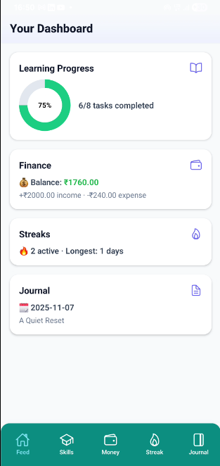
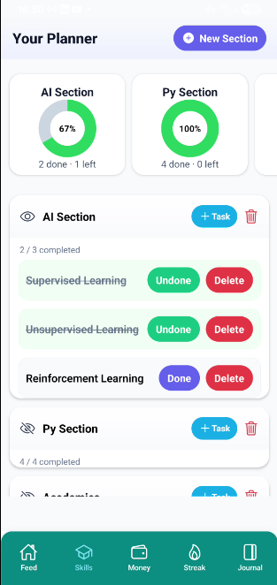
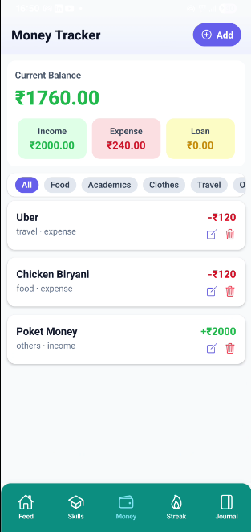
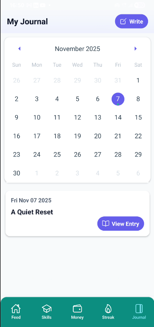
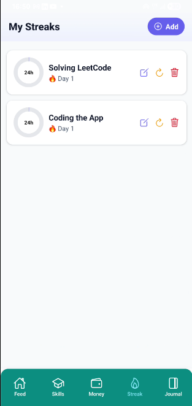
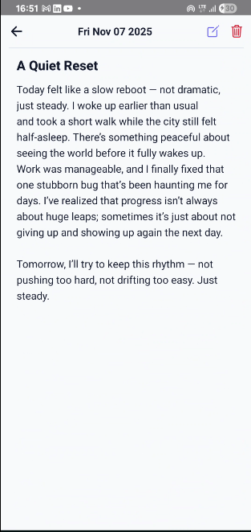

# 🌿 Meet `Manager` : A personal Productivity Tracker App

A beautifully designed **React Native (Expo)** app that unifies your **Learning Progress**, **Finance Tracking**, **Daily Streaks**, and **Journal Entries** into a single dashboard — built with Expo Tabs layout.

> _A personal productivity companion that blends focus, finance, and reflection._

---

## 🧭 Overview

This app helps you manage every part of your self-improvement journey — from what you’re learning, how you’re managing your money, keeping up your daily habits, to writing down your reflections.  
All data is **stored locally using AsyncStorage**, ensuring smooth offline use and fast performance.

---

## ⚙️ Tech Stack

| Category | Tools |
|-----------|-------|
| Framework | [React Native](https://reactnative.dev/) + [Expo](https://expo.dev/) |
| Navigation | `expo-router` (Tabs via `_layout.tsx`) |
| State & Storage | `React Hooks`, `@react-native-async-storage/async-storage` |
| Charts & UI | `react-native-gifted-charts`, `expo-linear-gradient`, `Ionicons` |
| Styling | Custom modern UI using `StyleSheet` and gradients |

---

## 🧩 App Structure

```

/app
├── _layout.tsx       → Tab navigation setup
├── index.tsx         → Dashboard (summary of all modules)
├── learn.tsx         → Learning planner (sections + tasks)
├── money.tsx         → Finance tracker (income, expenses, balance)
├── streak.tsx        → Streak tracker (habit consistency)
├── journal.tsx       → Journal with calendar and editor

````

Each tab is fully persistent via AsyncStorage and updates the `index.tsx` dashboard dynamically when you navigate back.

---

## 🚀 Features

### 📘 Learning Planner
- Create “Sections” for your learning projects  
- Add, mark, or delete tasks  
- Animated expand/collapse  
- Summary pie chart showing completion progress  

### 💰 Finance Tracker
- Track income and expenses across categories  
- Color-coded balance display (green, yellow, red)  
- Quick add, edit, and delete  
- Category chips and transaction summaries  

### 🔥 Streak Tracker
- Maintain your consistency for daily habits  
- Automatically increments every 24 hours  
- Reset, edit, or delete streaks  
- Pie chart shows remaining hours before next increment  

### 📓 Journal
- Calendar to select dates  
- Full-screen writing editor with title and word limit  
- View, edit, or delete previous entries  
- Private and local storage only  

### 📊 Dashboard
- Unified summary of all four modules  
- Auto-refreshes via `useFocusEffect` when returning from tabs  
- Pull-to-refresh support for manual reload  
- Dynamic charts and stats across all sections  

---

## 🧠 Design Philosophy

The UI design is intentionally clean and focused on clarity —  
soft gradients, rounded cards, minimal distractions, and high readability.  

Inspired by modern productivity tools like Notion and Reflect,  
this app aims to **help users think clearly and track progress calmly**.

---

## 🧑‍💻 Contributors

### 👨‍💻 **Aishwaray Tiwary (@lishav123 (owner))**
- Concept, architecture, and full implementation  
- Designed UI/UX and navigation structure using Expo Tabs  
- Integrated AsyncStorage persistence  
- Developed and documented all 4 app modules  

### 🤖 **ChatGPT (OpenAI GPT-5)**
- Guided architectural decisions and refactoring  
- Helped design consistent UI/UX themes  
- Provided in-depth documentation and best practices  
- Assisted in debugging and performance optimization  

> _Built through a collaboration of human creativity and AI engineering._

---

## 📸 Screenshots

| Dashboard | Learn | Money | Journal | Streak | Journal continue |
|------------|--------|--------|----------|----------|----------|
|  |  |  |  |  | 

---

## 💡 Setup & Run

### 1️⃣ Install dependencies
```bash
npm install
# or
yarn install
````

### 2️⃣ Run the Expo project

```bash
npx expo start
```

Scan the QR code with the Expo Go app or run it in your Android/iOS emulator.

---

## 🧱 Future Improvements

* 🔄 Cloud sync with Supabase or Firebase
* 🧠 AI-generated learning plans and journal summaries
* 🎨 Dark mode and custom themes
* 📤 Data export and analytics

---

## ⚖️ License

This project is released under the **MIT License** — feel free to use, modify, and contribute.

---

### 🌱 *“Discipline, reflection, and growth — all in your pocket.”*
